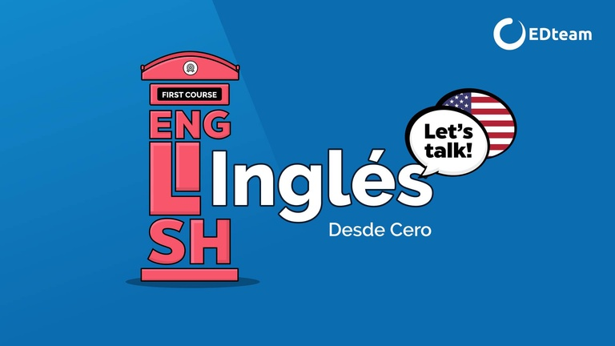

# The alphabet 

| LETRA | PRONUNCIACIÓN | LETRA | PRONUNCIACIÓN |
| :-----: | :------: | :-----: | :-----: |
| A | *ei* | O | *ou* |
| B | *bi* | P | *pi* |
| C | *ci* | Q | *kiu* |
| D | *di* | R | *ar* |
| E | *i* | S | *es* |
| F | *ef* | T | *ti* |
| G | *yi* | U | *iu* |
| H | *eich* | V | *vi* |
| I | *ai* | W | *dobliu* |
| J | *yei* | X | *ex* |
| K | *kei* | Y | *uai* |
| L | *el* | Z | *zi* |
| M | *em* |  |  |
| N | *en* |  |  |

Hay diferencias entre la pronunciación de las letras:

* `em` --> /em/ (se cierra la boca en la pronuciación)

* `en` --> /en/ (nasal)

* `b` --> /bi/
* `v` --> /vi/ (la pronunciación es la misma, salvo que al inicio hay una pequeña vibración el inicio entre los dientes y los labios)

### How do you spell your name?

it spells ...

    F-R-A-N-C-E-S-C-O-L-Y        /ef-ar-ei-en-ci-i-es-ci-ou-el-uai/
    P-A-O-L-O                    /pi-ei-ou-el-ou/
    P-E-R-E-Z                    /pi-i-ar-i-zi/

Video de la clase
